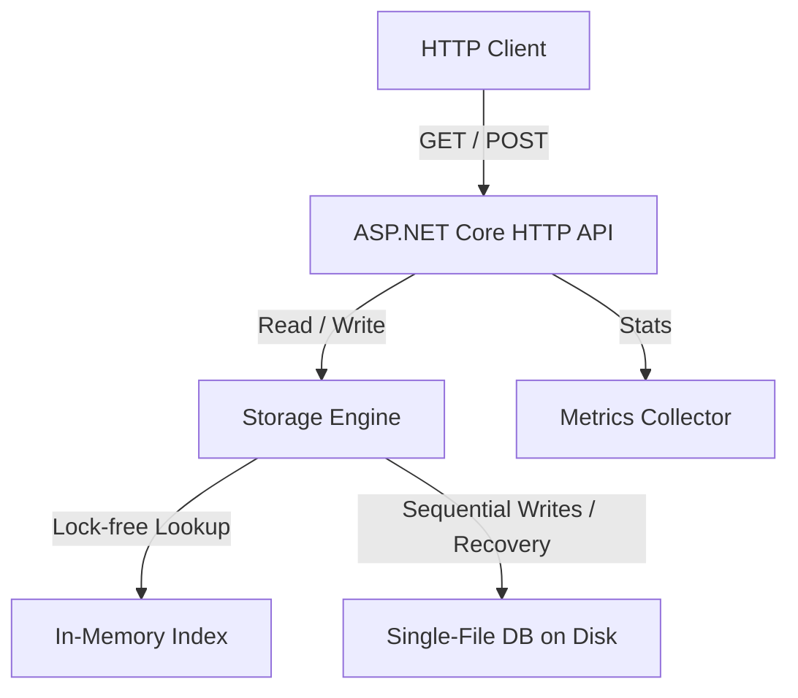
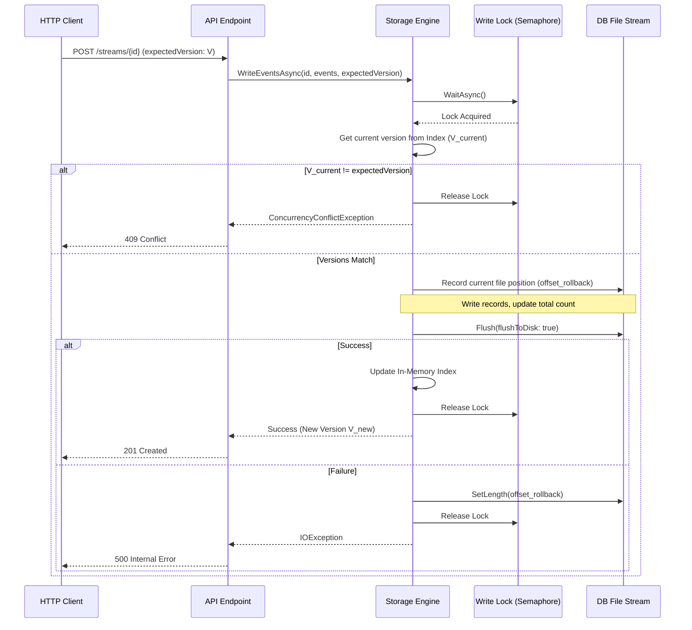

# Implementation Plan: MinniStore Event Store

MinniStore (or Minni) is a lightweight, high-performance event store database management system written in C# (.NET). It stores immutable events in an append-only single-file database format on disk and exposes a HTTP REST API for operations.

---

## 1. System Architecture

MinniStore is composed of three core layers:
1. **Hosting & CLI Layer**: Parses command-line arguments, boots the ASP.NET Core Kestrel server, and handles clean shutdown.
2. **API & Instrumentation Layer**: Exposes HTTP endpoints for reads, writes, and health/metrics. Measures performance stats in real-time.
3. **Storage Engine Layer**: Rebuilds the in-memory index on startup, handles lock-free reads, manages atomic writes to the database file, and guarantees optimistic concurrency checks.



---

## 2. Database File Format Design (Binary Layout)

To ensure high performance, simplicity, and safety against partial/failed writes, the database file will use a custom binary format.

### Log File Header
At offset `0`, the database starts with a 5-byte file header:
* `Magic Bytes` (4 bytes): `MNST` (`0x4D 0x4E 0x53 0x54`)
* `Version` (1 byte): `0x01`

### Record Block Structure
Every event appended to the database is written as a contiguous block of bytes:

| Field Name | Type | Size (Bytes) | Description |
| :--- | :--- | :--- | :--- |
| **Record Marker** | `Byte` | 1 | Magic byte `0xEE` to signal the start of a record. |
| **Record Length** | `Int32` | 4 | Total size of the record block (excluding marker & length field). |
| **Timestamp** | `Int64` | 8 | Unix timestamp in milliseconds. |
| **Aggregate ID Length** | `UInt16` | 2 | Size of the aggregate ID string. |
| **Aggregate ID** | `UTF-8 Bytes` | Variable | The identifier string for the aggregate. |
| **Data Blob Length** | `Int32` | 4 | Size of the payload data. |
| **Data Blob** | `Bytes` | Variable | The client-serialized event payload. |
| **Checksum** | `UInt32` | 4 | CRC32 or FNV-1a checksum of all preceding record fields. |

### Integrity & Recovery Protocol
* **Interrupted Writes**: If the database server crashes mid-write, the file will contain a trailing partial record.
* **On Startup Scan**:
  1. The server reads the file sequentially from offset `5`.
  2. For each block:
     * Check if remaining file size is enough to read the record length.
     * Validate the record marker (`0xEE`).
     * Read the full block and verify the checksum.
     * If any validation fails, the server **truncates** the database file at the last valid record boundary and starts successfully, preserving database integrity.

---

## 3. Storage Engine & In-Memory Index

To satisfy the requirement of high performance, MinniStore uses an in-memory index mapping aggregate IDs to file locations.

### Index Data Structure
The stream sequence/version number of each event is derived implicitly from its 1-based index/position in the `ImmutableList<EventIndexEntry>`. This avoids persisting redundant sequence number data to disk.

```csharp
public record EventIndexEntry(
    long FileOffset,      // Position of record marker in DB file
    int RecordSize,       // Total size of record on disk
    long Timestamp        // Event timestamp
);

// Lock-free reads and efficient updates
private readonly ConcurrentDictionary<string, ImmutableList<EventIndexEntry>> _index = new();
```

### Write Pipeline (Atomicity & Concurrency)
All database writes are routed through a single-writer lock (`SemaphoreSlim(1, 1)`).



---

## 4. REST API Specifications

MinniStore exposes lightweight endpoints built on ASP.NET Core Minimal APIs.

### 1. Append Events
* **Method**: `POST`
* **Route**: `/streams/{aggregateId}`
* **Headers**:
  * `If-Match`: (Optional) Expected current version/sequence number of the stream (integer).
* **Request Body**:
  ```json
  {
    "expectedVersion": 4, // Optional alternative to If-Match header
    "events": [
      {
        "data": "eyJrZXkiOiAidmFsdWUifQ==" // Base64-encoded string
      }
    ]
  }
  ```
* **Success Response** (`201 Created`):
  ```json
  {
    "aggregateId": "order-1029",
    "currentVersion": 5
  }
  ```
* **Error Responses**:
  * `409 Conflict`: Concurrency conflict (expected version mismatch).
  * `400 Bad Request`: Missing body, invalid base64 data, or malformed schema.

### 2. Retrieve Stream
* **Method**: `GET`
* **Route**: `/streams/{aggregateId}`
* **Query Parameters**:
  * `fromVersion`: (Optional, default = 1) Read events starting from this sequence number (inclusive).
* **Success Response** (`200 OK`):
  ```json
  [
    {
      "sequenceNumber": 1,
      "timestamp": 1782930292300,
      "data": "eyJrZXkiOiAidmFsdWUifQ=="
    }
  ]
  ```

---

## 5. Instrumentation & Metrics

Status information is collected dynamically with minimal allocation overhead.

### Metrics Structure
```json
{
  "totalEvents": 14209,
  "totalAggregates": 412,
  "writesPerSecond": 12.4,
  "readsPerSecond": 45.2,
  "uptimeSeconds": 3600,
  "lastWriteTimestamp": 1782930292300
}
```

### Implementation Strategy
1. **Reads/Writes per Second**:
   * Implement a rolling array of 10 bucket counters (each 1-second long).
   * A background timer thread shifts the index every second and resets the oldest bucket.
   * On read/write, atomically increment the current second's bucket.
   * Rates are calculated as: `Sum(10 buckets) / 10.0`.
2. **Total Events**:
   * Monotonically increasing `long` counter incremented atomically on successful writes.
3. **Total Aggregates**:
   * Tracked as the `Count` property of our thread-safe in-memory stream index (`_index.Count`), which runs in $O(1)$ time complexity.
4. **Uptime (seconds)**:
   * Process start time is recorded at application boot. `uptimeSeconds` is computed as `(DateTime.UtcNow - StartupTime).TotalSeconds` on request.
5. **Last Write Timestamp**:
   * Initialized at startup by inspecting the database file's metadata (`File.GetLastWriteTimeUtc(dbPath)`).
   * Updated in memory with the current UTC timestamp (unix milliseconds) on every successful append write operation.

---

## 6. Project Structure

```
C:\dev\minnistore\
├── spec\
│   ├── specification.md         # Requirements
│   └── implementation-plan.md   # This document
├── src\
│   └── MinniStore\
│       ├── MinniStore.csproj    # .NET 8.0 Console / Web App Project
│       ├── Program.cs           # Main entry, CLI args parsing, App startup
│       ├── Storage\
│       │   ├── IStorageEngine.cs
│       │   ├── StorageEngine.cs # Binary file operations, write locking, rollback
│       │   └── Models.cs        # EventRecord, EventIndexEntry models
│       ├── API\
│       │   └── StreamEndpoints.cs # REST API routing & body structures
│       └── Metrics\
│           └── MetricsCollector.cs # Reads/Writes rate metrics
└── tests\
    └── MinniStore.Tests\
        ├── MinniStore.Tests.csproj
        ├── StorageEngineTests.cs
        ├── ConcurrencyTests.cs
        └── ApiTests.cs
```

---

## 7. Implementation Roadmap

### Phase 1: Project Setup & CLI
* Initialize the .NET 8 project and folder structure.
* Build CLI argument parsing for `--port` and `--db`.
* Implement bootstrap code to start Kestrel server on the configured port.

### Phase 2: Binary Log & Storage Engine
* Define binary layout models and helpers (checksum, block layout).
* Implement startup scanning logic to read all events, construct the `ConcurrentDictionary` index, and verify checksum integrity. Add file truncation/recovery for corrupted tails.
* Implement write log flow with `SemaphoreSlim` locking and transactional file rollbacks.

### Phase 3: REST API & Concurrency
* Bind Kestrel endpoints: `POST /streams/{id}` and `GET /streams/{id}`.
* Enforce optimistic concurrency check checks using either `If-Match` headers or request JSON parameters.
* Test that multiple writers attempting to append at the same version fail gracefully with `409 Conflict`.

### Phase 4: Instrumentation & Endpoint Setup
* Write `MetricsCollector` with bucket-based sliding metrics.
* Add `/metrics` or `/stats` endpoint exposing metrics in JSON format.

### Phase 5: Integration & Verification
* Implement a suite of unit and integration tests using `xUnit`, `Moq`, and `Shouldly`.
* Test scenarios: concurrent/multithreaded writers (verifying OCC concurrency conflicts), corrupted database files (verifying start-up recovery/truncation), and large event payloads.
* Verify memory allocation footprint and read/write performance.

---

## 8. Cross-Cutting Concerns & Testing Frameworks

### Dependency Injection (DI)
- Use the standard .NET dependency injection library (`Microsoft.Extensions.DependencyInjection`).
- Register all main components (`StorageEngine` as Singleton/Transient, `MetricsCollector` as Singleton) at startup in `Program.cs`.
- Inject dependencies via constructors for clean, testable code.

### Logging
- Use standard Microsoft `ILogger<T>` logging abstractions.
- By default, configure logging to write to **Console** output (`builder.Logging.AddConsole()`) to allow the runner process and administrators to see real-time execution logs.

### Testing Stack & Coverage
All tests are implemented in the `tests/MinniStore.Tests` project using:
- **Test Framework**: [xUnit](https://xunit.net)
- **Mocking**: [Moq](https://github.com/moq/moq4) (used for mocking loggers, file systems, or HTTP context where necessary)
- **Assertions**: [Shouldly](https://github.com/shouldly/shouldly) (for fluent assertions like `result.ShouldBe(expected)`)
- **Coverage Goal**: **100% line and branch coverage** for the core production codebase.
- **Coverage Verification**: Code coverage will be collected using `coverlet.collector` and measured with `dotnet test /p:CollectCoverage=true` to ensure absolute test coverage validation.
